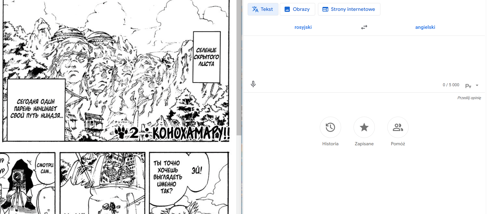
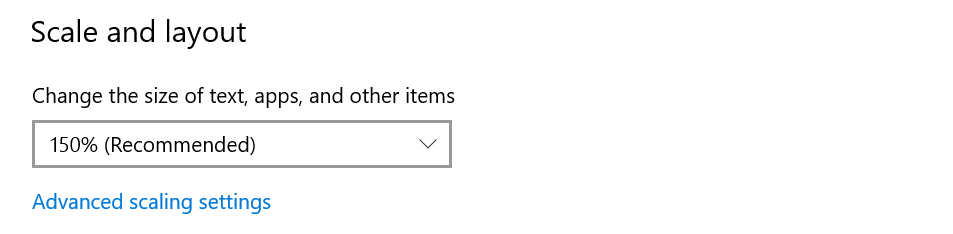
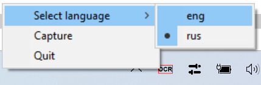

# fastOCR

App for convenient and fast OCR, all you need to do is press given shortcut and select area you want to read, then it will be copied to your clipboard.

**IMPORTANT! YOU NEED TO HAVE INSTALLED [TESSERACT](https://github.com/tesseract-ocr/tesseract?tab=readme-ov-file#installing-tesseract) AND ADDED IT TO SYSTEM'S PATH ENVIRONMENT VARIABLE** 

## CONFIG

### screen-scale

A float value that must be set to the scaling factor of your screen.

### alpha-value

A float value that sets how much app is transparent

0.0 - fully transparent, 1.0 - non transparent

### shortcut

A string value that sets shortcut for app to run, for example: "ins", or "ctrl+shift+a"

### languages

List of languages

**IMPORTANT! NAME OF LANGUAGES MUST CORRESPOND TO THE .traineddata FILES IN Tesseract-OCR/tessdata**